# ARC3 Synthetic Games & Agent Trajectories

**50 independently created Studio games · 75 games with AI demonstrations · 550 recorded level solves**

Abstract, turn-based ARC3-compatible games and compact source-informed AI-agent
trajectories for studying environment models, planning and learning.

**[Play the Studio games](https://felix561.github.io/arc3-synthetic-games/)** ·
[Game index](docs/GAMES.md) · [Trajectory format](docs/TRAJECTORIES.md) ·
[Statistics](docs/STATISTICS.md) · [Player releases](https://github.com/Felix561/arc3-synthetic-games/releases/latest)

<table>
<tr>
<td>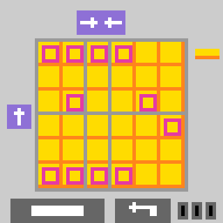</td>
<td>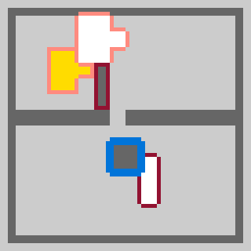</td>
<td>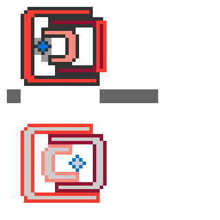</td>
<td>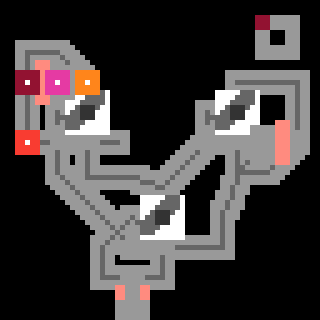</td>
</tr>
<tr>
<td align="center"><sub>Studio V2 · Fold and Pierce</sub></td>
<td align="center"><sub>Studio V2 · Body Relay</sub></td>
<td align="center"><sub>Studio V2 · Nested Access</sub></td>
<td align="center"><sub>Studio V2 · Ongoing Motion</sub></td>
</tr>
<tr>
<td>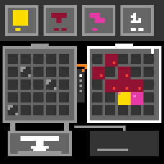</td>
<td>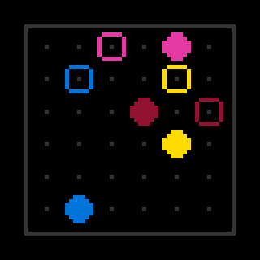</td>
<td>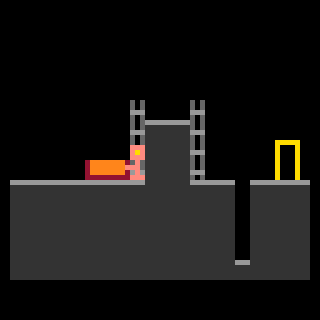</td>
<td>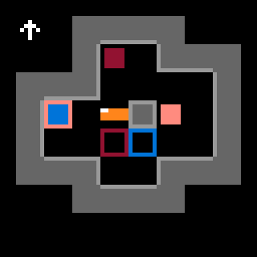</td>
</tr>
<tr>
<td align="center"><sub>Studio SG07 · level 7</sub></td>
<td align="center"><sub>Studio SG18 · level 7</sub></td>
<td align="center"><sub>Studio SG24 · level 6</sub></td>
<td align="center"><sub>Studio SG25 · level 7</sub></td>
</tr>
<tr>
<td>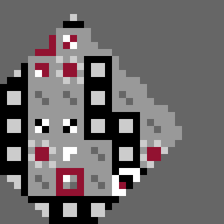</td>
<td>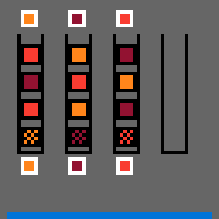</td>
<td>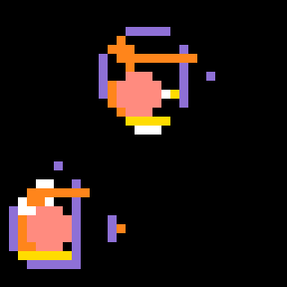</td>
<td>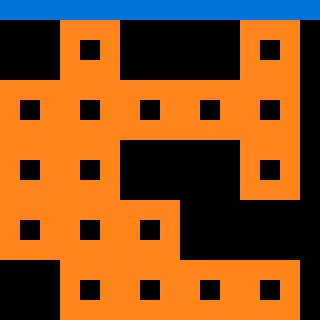</td>
</tr>
<tr>
<td align="center"><sub>NVIDIA CC2048 · level 7</sub></td>
<td align="center"><sub>NVIDIA DF4821 · level 7</sub></td>
<td align="center"><sub>NVIDIA SS6041 · level 7</sub></td>
<td align="center"><sub>NVIDIA FW4821 · level 7</sub></td>
</tr>
</table>

<sub><b>AI-agent gameplay, with source access.</b> Twelve solved-level previews; these reveal solutions. V219 includes native animation frames; the other previews show settled observations. Playback timing is illustrative. Source, level, actions and provenance are in the <a href="media/agent-demos/manifest.json">media manifest</a>.</sub>

Version **2.0.0** adds 20 Studio games, V201–V220, with 140 successful level
demonstrations. Play the Studio collection or use the trajectory dataset, including
25 synthetic environments from
[NVIDIA DreamTeam](https://github.com/NVIDIA/dream-team/tree/main/arc_agi_3).
The collections stay in three separate, attributed partitions.

## What's included

| Source | Games | Levels | Recorded level attempts | Solved / unsolved | Policy actions |
| --- | ---: | ---: | ---: | ---: | ---: |
| [Studio](trajectories/studio) — SG01–SG30 synthetic games | 30 | 210 | 210 | 210 / 0 | 2,344 |
| [NVIDIA DreamTeam](trajectories/nvidia) — third-party synthetic games | 25 | 200 | 205 | 200 / 5 | 3,667 |
| [Studio V2](trajectories/studio_v2) — V201–V220 synthetic games | 20 | 140 | 140 | 140 / 0 | 1,740 |
| **Total** | **75** | **550** | **555** | **550 / 5** | **7,751** |

Each game has a recorded source-informed AI solution across its levels. Original
Studio and NVIDIA partitions retain their five reset-interrupted attempts; Studio
V2 contains successful level segments only. Original full runs passed fresh native
replay on their exact packages and recorded seed before export. These counts
describe collected experience, not blind benchmark performance, optimality or
human-efficiency scores.

**These trajectories are AI-played, not human-played.** Dedicated Codex agents
could inspect mechanics and game source before choosing actions. The collection
configuration requested **GPT-6.1-sol**: ultra reasoning for the original
partitions, and ultra/xhigh requests across V2. Effective model identity was not
independently measured. Assistance and source-exposure limits
are documented in [the trajectory card](docs/TRAJECTORIES.md). All demonstrations were
collected for this project; NVIDIA authored its environments, not these agent runs.

## Download the dataset

**[Download all 75 synthetic environments and AI trajectories (ZIP)](https://github.com/Felix561/arc3-synthetic-games/releases/download/v2.0.0/arc3-synthetic-games-v2.0.0-dataset.zip)**

Extract into an empty folder and run `python tools/load_dataset.py`. No installation
is needed to read the data. The archive includes exact native game packages,
compact palette-grid training rows, Recorder-style native replays, checksums and
separate Studio/NVIDIA licenses. See [download and loading guide](docs/DOWNLOADS.md).

| Download | Contents |
| --- | --- |
| [Complete dataset](https://github.com/Felix561/arc3-synthetic-games/releases/download/v2.0.0/arc3-synthetic-games-v2.0.0-dataset.zip) | All 75 environments and their AI data |
| [Trajectories only](https://github.com/Felix561/arc3-synthetic-games/releases/download/v2.0.0/arc3-synthetic-games-v2.0.0-agent-trajectories.zip) | AI recordings, manifests and statistics; no game code |
| [Studio environments only](https://github.com/Felix561/arc3-synthetic-games/releases/download/v2.0.0/arc3-synthetic-games-v2.0.0-environments.zip) | 50 Studio games in native ARC3-compatible layout |
| [Source and player](https://github.com/Felix561/arc3-synthetic-games/releases/download/v2.0.0/arc3-synthetic-games-v2.0.0-source.zip) | Local player, code, data and documentation |

These are independent synthetic games, **not official ARC Prize training games**.
Native replay envelopes follow the Recorder style; segmented training rows use our
[documented schema](docs/TRAJECTORIES.md), so check your loader's field expectations.

## Use the trajectory data

The three partitions contain 555 segments in total. Load each once for the complete dataset.

```python
import gzip
import json
from pathlib import Path

for source in ("studio", "studio_v2", "nvidia"):
    path = Path("trajectories") / source / "trajectories.jsonl.gz"
    with gzip.open(path, "rt", encoding="utf-8") as stream:
        for line in stream:
            episode = json.loads(line)
            # Palette observations: [actions + 1, 64, 64], integer values 0–15.
            observations = episode["observations"]
            actions = episode["actions"]
            solved = episode["is_solved"]
```

Canonical rows contain observations, actions, valid-action information and
outcome flags. Native JSONL/gzip files preserve response animation frames in the
ARC Prize Recorder-style `timestamp` / `data` envelope. Original partitions contain
complete game recordings; V2 contains seven successful per-level response excerpts
per game, not standalone full-game replay files. Everything is losslessly
compressed; RGB images are not the training format. Unknown times remain `null`.

Start with [TRAJECTORIES.md](docs/TRAJECTORIES.md) for loading, resets, coordinate
conventions, provenance and license scope. [Machine-readable statistics](trajectories/statistics.json)
and CSVs support independent analysis. The player wheel and environments-only
release contain only Studio content; use this repository or the separate
trajectory archive for the agent data and NVIDIA dependencies.

## Explore the statistics

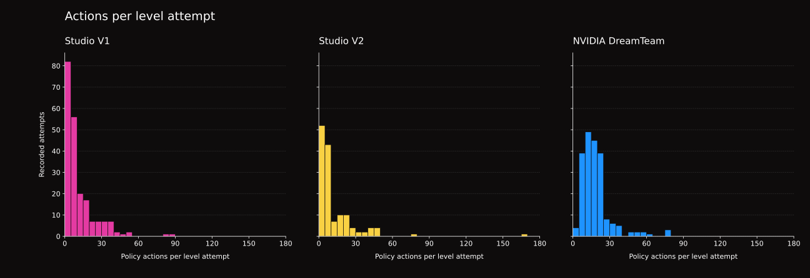

<sub><b>Figure 1.</b> Policy-action counts for all 555 recorded attempts, including five reset-interrupted NVIDIA attempts. Reset controls are counted separately; the three partitions retain their distinct collection policies.</sub>

<sub><b>Interpretation.</b> One source-informed AI-agent run per game, with retries retained. These are descriptive action lengths, not blind success rates, human-efficiency scores or optimal solution lengths.</sub>

The [statistics page](docs/STATISTICS.md) includes per-game attempts, outcomes, total
actions and segment-length distributions.

## Play locally

Use **Python 3.12**. From this repository, or an extracted Studio source release:

```bash
python -m pip install -e .
arc3-synthetic-games play
```

The browser opens at **http://127.0.0.1:8780**. No Docker, API key, account or
internet connection is needed to play after installation. Select any of the
seven levels, reset a level, or restart a game. Controls are arrows, Space,
clicking and Undo (`Z`), depending on the game.

```bash
arc3-synthetic-games play --port 8781 --no-browser
arc3-synthetic-games verify
arc3-synthetic-games list
```

The local and GitHub Pages players currently cover **Studio's 50 games**.
Mechanics explanations and human gameplay GIFs are opt-in. Gameplay stays in
memory; neither player records or uploads actions.

The browser demo runs the native Python games through WebAssembly, without an
account or API key. Its first runtime download needs internet access. GitHub and
the runtime CDN handle ordinary asset requests under their own privacy policies.

## Use the native environments

Studio's `environment_files/` uses the public ARC3 package arrangement: one
game/version directory with Python source and `metadata.json`. Use exact IDs and
hashes in `catalog.json`; the trajectory manifest binds the same native versions.
For reproducible native use, the validated dependencies are:

```bash
python -m pip install arc-agi==0.9.8 arcengine==0.9.3 numpy==2.5.3
```

```python
import json
from arc_agi import Arcade, OperationMode
from arcengine import GameAction

with open("catalog.json", encoding="utf-8") as file:
    catalog = json.load(file)
arcade = Arcade(operation_mode=OperationMode.OFFLINE,
                environments_dir="environment_files")
game = arcade.make(catalog["games"][0]["game_id"], seed=0, save_recording=False)
observation = game.reset()
observation = game.step(GameAction.ACTION1)
```

NVIDIA's unchanged packages are separate under
[`third_party/nvidia/environment_files/`](third_party/nvidia/environment_files).
Their pinned runtime support, upstream revision, checksums and licenses are
included; they have **eight levels**, rather than Studio's seven. See the
[NVIDIA setup](docs/TRAJECTORIES.md#nvidia-environments) before replaying them.
Native code executes Python; run unfamiliar environments in isolation.

## Validation and limitations

Recorded solution paths passed fresh native replay checks on their exact packages
and seed. Pixel/action alignment, completion boundaries, retries
and dataset accounting were checked. [Validation](docs/VALIDATION.md) distinguishes
this evidence from player compatibility and human playtesting.

The dataset is small and source-informed, with one actor per game. It does not
measure source-blind exploration, human discoverability, optimal solutions,
all-seed solvability or generalization. Complete solvability of every possible state and seed is not established.
Official ARC3 human baselines and scores are not supplied. Keep source, mechanics and provenance out of a learner's
observation inputs unless deliberately studying privileged information.

Studio V2 uses an independently implemented functional construction scaffold
inspired by [NVIDIA DreamTeam](https://github.com/NVIDIA/dream-team/tree/main/arc_agi_3).
Designers consulted public ARC3 games for abstract design references; no official
ARC3 source or trajectories are redistributed.

## Development and hosting

```bash
python -m pip install -e ".[dev]"
python -m pytest -q
python tools/build_preview.py  # Static Studio site in _site/
```

Native tests execute game Python; run them in an isolated development/CI
environment. Data-only trajectory checks do not require executing games.
[Publishing instructions](docs/PUBLICATION.md) describe package scopes and GitHub Pages.

## License and citation

Original Studio games, player, documentation, Studio agent data and original
presentation assets are [MIT-licensed](LICENSE). NVIDIA game code, runtime support,
NVIDIA-based agent recordings and derived presentation assets are distributed
with [Apache-2.0 and applicable retained third-party notices](third_party/nvidia/LICENSE).
The repository's MIT license does not replace NVIDIA's license or attribution.
See [third-party acknowledgments](THIRD_PARTY_NOTICES.md) and [CITATION.cff](CITATION.cff).

This is an independent research dataset, with no NVIDIA or ARC Prize endorsement.
No official ARC3 environments or human trajectory dataset are redistributed.

## AI disclosure

AI assisted the design, implementation and documentation of the Studio games,
with human feedback and playtesting of earlier games. The trajectory dataset and twelve agent replay
GIFs show **source-informed AI-agent gameplay**. The six human gameplay GIFs are
labelled separately; no raw human trajectories are included.
