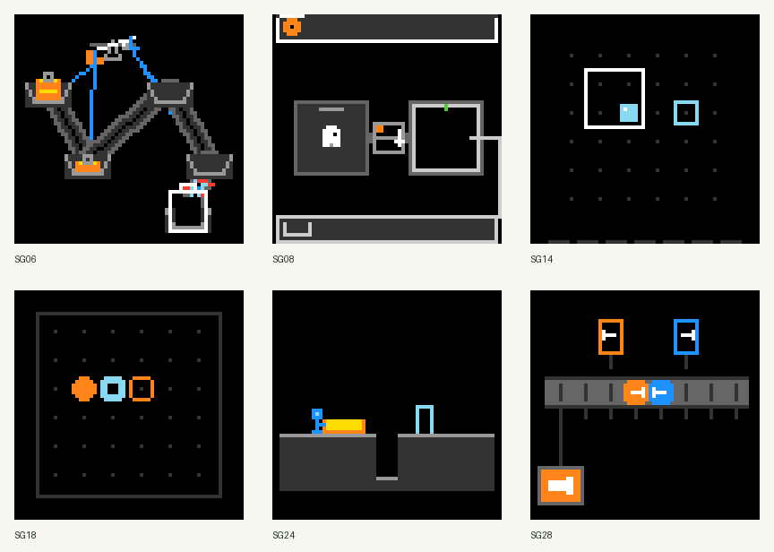
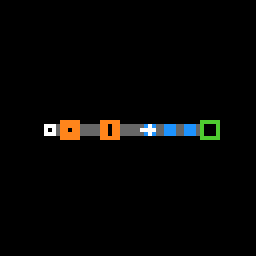
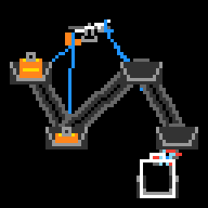
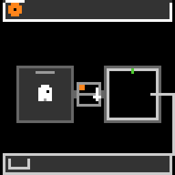
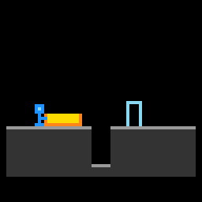
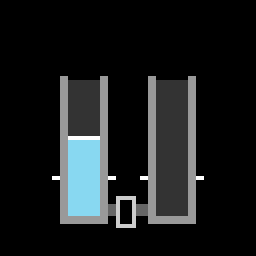
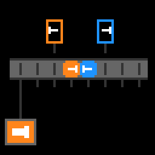

# ARC3 Synthetic Games

**30 games · 210 levels · native 64×64 ARC3 environments**

An independent collection of abstract, turn-based games for people and reasoning
agents. Each game has a distinct set of rules and seven fixed levels. Explore,
experiment, and discover how each world works.

**[Play in your browser](https://felix561.github.io/arc3-synthetic-games/)** ·
[Download a release](https://github.com/Felix561/arc3-synthetic-games/releases/latest) ·
[Browse all 30 games](GAMES.md)



The browser demo runs the original Python games through WebAssembly. There is
nothing to install and no account or API key. The first game downloads a runtime
from a CDN, so an internet connection is needed. Actions and progress stay in
your tab's memory; the player does not record or upload gameplay. GitHub and the
runtime CDN handle ordinary web requests under their own privacy policies.

Integrity, compatibility and player tests have been run. Complete solvability
of every level has not been independently verified; see [validation](VALIDATION.md).

## Play locally

Use **Python 3.12**. Download and extract the source release, or clone this
repository, then run from its directory:

```bash
python -m pip install -e .
arc3-synthetic-games play
```

The browser opens at **http://127.0.0.1:8780**. No Docker, API key, account or
internet connection is needed to play after installation. You can select any
of the seven levels, reset a level, or restart a game. Available controls are
arrows, Space, clicking and Undo (`Z`), depending on the game.

Mechanics explanations and human-played demonstrations are opt-in. Gameplay
stays in memory. The local player executes the curated game sources; keep it
on your own computer.

```bash
arc3-synthetic-games play --port 8781 --no-browser
arc3-synthetic-games verify
arc3-synthetic-games list
# Equivalent module entry point:
python -m arc3_synthetic_games play
```

You can also install the release wheel with `python -m pip install <wheel-file>`.

## Use the native environments

The `environment_files/` directory has the same native package arrangement as
public ARC3 environments: one game/version directory with Python source and
`metadata.json`. Copy that directory into an existing offline ARC3 project, or
use it directly with the official SDK. No player or custom Studio adapter is
required by the games.

The **environments ZIP** provides these files with the catalog and documentation.
All 30 games are available without a prescribed split or sampling quota.

For native-only use, install the validated dependencies on Python 3.12:

```bash
python -m pip install arc-agi==0.9.8 arcengine==0.9.3 numpy==2.5.3
```

From the repository directory:

```python
import json
from arc_agi import Arcade, OperationMode
from arcengine import GameAction

with open("catalog.json", encoding="utf-8") as file:
    catalog = json.load(file)

arcade = Arcade(
    operation_mode=OperationMode.OFFLINE,
    environments_dir="environment_files",
)
game_id = catalog["games"][0]["game_id"]  # Exact SG01 native version
game = arcade.make(game_id, seed=0, save_recording=False)
assert game is not None
observation = game.reset()
observation = game.step(GameAction.ACTION1)
```

Use the exact `game_id` values in the catalog to bind experiments to this release.
The catalog supplies file SHA-256 hashes and human-facing descriptions; learner
inputs can remain limited to native observations and available actions. These
environments have no measured official human-efficiency baselines. SDK scorecard
values must not be interpreted as comparable official benchmark scores.

## Browse the collection

See [the game index](GAMES.md) for short discovery-first descriptions, and the
[dataset card](DATASET_CARD.md) for composition, validation and limitations.
Native metadata keeps the stable SG labels; descriptive titles live in the
catalog and player.

<details>
<summary>Show six human-played demonstrations — contains early-level spoilers</summary>

The following excerpts show real current-version gameplay. Only native game
pixels are included; pauses are shortened. Raw trajectories and identifying
recording metadata are not distributed.

| SG01 | SG06 | SG08 |
| --- | --- | --- |
|  |  |  |

| SG24 | SG26 | SG28 |
| --- | --- | --- |
|  |  |  |

</details>

## Development and hosting

```bash
python -m pip install -e ".[dev]"
python -m pytest -q
python tools/build_preview.py  # Static site in _site/
```

Native tests execute game Python. Run them in an isolated development/CI
environment. No raw human trajectories or solutions are required by the tests.
Use `arc3-synthetic-games verify` for data-only integrity checks.

The static demo can be hosted on GitHub Pages without a backend.
[Publishing instructions](PUBLICATION.md) describe the one-time Pages setup and
release packages. GitHub README files link to the demo rather than embed scripts.

## License and citation

Original games, player, documentation and demonstration assets are available
under the [MIT license](LICENSE). The [official ARC-AGI toolkit](https://github.com/arcprize/ARC-AGI)
and ARC engine are separate dependencies; see [third-party acknowledgments](THIRD_PARTY_NOTICES.md).
Citation metadata is in [CITATION.cff](CITATION.cff).

## AI disclosure

This collection was created with substantial AI assistance in game design,
implementation and documentation, informed by human feedback and playtesting.
The demonstration GIFs show actual human gameplay.
