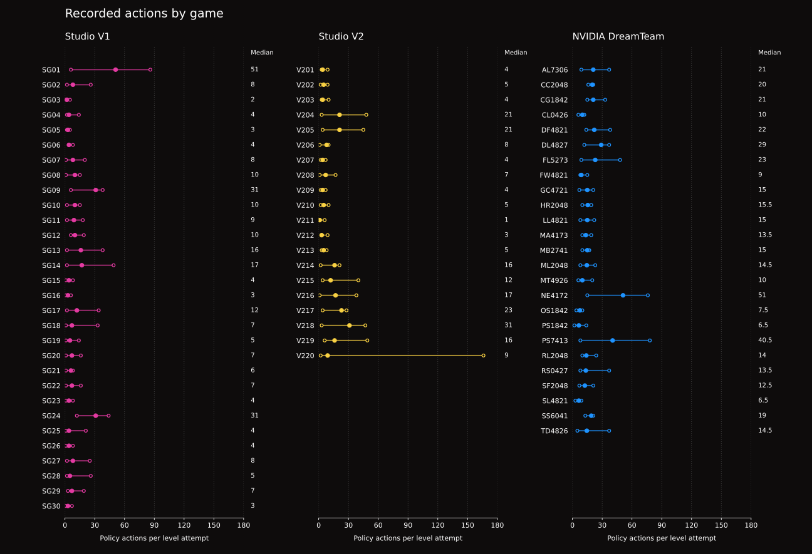

# Agent dataset statistics

Snapshot: **`arc3-source-informed-agent-20261002-v1`**, seed 0, collected October 2,
2026. These are source-informed AI-agent recordings, not human demonstrations,
source-blind trials or official benchmark scores.

## Coverage and observed outcomes

| Measure | Studio | NVIDIA DreamTeam | Total |
| --- | ---: | ---: | ---: |
| Games / complete recorded runs | 30 | 25 | 55 |
| Distinct levels | 210 | 200 | 410 |
| Recorded level-attempt segments | 210 | 205 | 415 |
| Solved segments | 210 | 200 | 410 |
| Unsolved reset-interrupted segments | 0 | 5 | 5 |
| Runs reaching native WIN | 30 | 25 | 55 |
| Policy actions, including undo | 2,344 | 3,667 | 6,011 |
| Click actions | 736 | 1,809 | 2,545 |
| Undo actions | 7 | 0 | 7 |
| Current-level reset controls | 0 | 5 | 5 |
| Initialization reset controls | 30 | 25 | 55 |
| Short segments, fewer than 6 actions | 95 | 8 | 103 |
| Native GAME_OVER responses | 0 | 0 | 0 |
| Levels solved in their first recorded attempt | 210 | 197 | 407 |
| Native recording responses | 2,374 | 3,697 | 6,071 |
| Native palette frames, including animation | 2,912 | 3,872 | 6,784 |

There is one dedicated gameplay actor and one completed run per game. All five
unsolved segments ended at a current-level reset while the native state was
`NOT_FINISHED`. They remain in the dataset, along with the later solved attempts.
Unsuccessful attempts occurred in NE4172 and TD4826; do not interpret the five
segments as five failed games or five native GAME_OVER events.

The observed segment completion fraction is **410 / 415 (98.8%)**. Full-game
coverage is **55 / 55**. These are descriptive counts of this deliberately
completed collection, with source access and retries, not estimates of a model's
success on unseen games. There is no measured human baseline or efficiency score.

## Action-count distributions

All recorded level attempts, including unsuccessful ones, are included.

| Policy actions per segment | Studio | NVIDIA DreamTeam | Total |
| --- | ---: | ---: | ---: |
| Minimum | 1 | 2 | 1 |
| Median | 6 | 15 | 11 |
| Mean | 11.2 | 17.9 | 14.5 |
| Maximum | 86 | 78 | 86 |

<b>Figure 1.</b> Five-action bins and common axes. Studio: 210 attempts, median 6 actions. NVIDIA: 205 attempts, median 15 actions. All 415 recorded attempts are included: 410 solved and five reset-interrupted. Reset controls are excluded from policy-action counts.

<b>Interpretation.</b> Source-informed AI-agent experience, with one completed run per game and retries retained. This is not a human baseline, blind evaluation or measure of optimality.

<b>Figure 2.</b> Each row is one game: open endpoints show the minimum and maximum recorded attempt lengths; the filled dot and adjacent number show the median. Both panels share a zero-based action scale. Studio has seven solved levels per game; NVIDIA has eight, plus five unsuccessful attempts retained across the collection.

<b>Interpretation.</b> Ranges describe observed attempts, not confidence intervals, game difficulty or minimum solution lengths. Each action is an engine step: blocked moves and undo count; reset controls, tokens, elapsed time and solver compute do not. The values match the downloadable CSVs.

## Per-game and per-level data

The [per-game CSV](../trajectories/per-game.csv) provides all 55 games with levels,
attempts, outcomes, total actions and min/median/mean/max attempt lengths.
The [per-segment CSV](../trajectories/per-segment.csv) provides all 415 source/game/
level/attempt identities, action counts and truthful outcome flags. These files
contain no frames or private actor identifiers, so they are convenient for
inspection and plotting without loading full trajectories.

[Machine-readable statistics](../trajectories/statistics.json) include source totals,
full metric definitions and native-recording counts. Recorded frames are palette
arrays: **6,071 native responses / 6,784 frames**. Animation frames are counted
separately from responses and policy actions. Historical recording timestamps
are null; duration, latency and cost statistics are unavailable.

## Per-game inventory

All values include unsuccessful recorded attempts. Median/range are policy
actions per level-attempt segment, not full-game lengths or optimal solutions.

### Studio - SG01-SG30

| Game | Attempts | Solved / unsolved | Total actions | Median | Min-max |
| --- | ---: | ---: | ---: | ---: | ---: |
| SG01 | 7 | 7 / 0 | 355 | 51 | 6-86 |
| SG02 | 7 | 7 / 0 | 83 | 8 | 2-26 |
| SG03 | 7 | 7 / 0 | 19 | 2 | 1-5 |
| SG04 | 7 | 7 / 0 | 40 | 4 | 2-14 |
| SG05 | 7 | 7 / 0 | 23 | 3 | 2-5 |
| SG06 | 7 | 7 / 0 | 39 | 4 | 4-8 |
| SG07 | 7 | 7 / 0 | 68 | 8 | 1-20 |
| SG08 | 7 | 7 / 0 | 63 | 10 | 1-15 |
| SG09 | 7 | 7 / 0 | 189 | 31 | 6-38 |
| SG10 | 7 | 7 / 0 | 60 | 10 | 2-15 |
| SG11 | 7 | 7 / 0 | 67 | 9 | 2-18 |
| SG12 | 7 | 7 / 0 | 81 | 10 | 6-19 |
| SG13 | 7 | 7 / 0 | 120 | 16 | 2-38 |
| SG14 | 7 | 7 / 0 | 154 | 17 | 2-49 |
| SG15 | 7 | 7 / 0 | 29 | 4 | 1-8 |
| SG16 | 7 | 7 / 0 | 23 | 3 | 1-6 |
| SG17 | 7 | 7 / 0 | 100 | 12 | 2-34 |
| SG18 | 7 | 7 / 0 | 106 | 7 | 1-33 |
| SG19 | 7 | 7 / 0 | 44 | 5 | 1-14 |
| SG20 | 7 | 7 / 0 | 52 | 7 | 1-16 |
| SG21 | 7 | 7 / 0 | 35 | 6 | 1-8 |
| SG22 | 7 | 7 / 0 | 53 | 7 | 1-16 |
| SG23 | 7 | 7 / 0 | 31 | 4 | 1-8 |
| SG24 | 7 | 7 / 0 | 199 | 31 | 12-44 |
| SG25 | 7 | 7 / 0 | 53 | 4 | 1-21 |
| SG26 | 7 | 7 / 0 | 29 | 4 | 1-8 |
| SG27 | 7 | 7 / 0 | 84 | 8 | 2-25 |
| SG28 | 7 | 7 / 0 | 55 | 5 | 2-26 |
| SG29 | 7 | 7 / 0 | 66 | 7 | 3-19 |
| SG30 | 7 | 7 / 0 | 24 | 3 | 1-7 |

### NVIDIA DreamTeam - 25 synthetic games

| Game | Attempts | Solved / unsolved | Total actions | Median | Min-max |
| --- | ---: | ---: | ---: | ---: | ---: |
| AL7306 | 8 | 8 / 0 | 174 | 21 | 9-37 |
| CC2048 | 8 | 8 / 0 | 158 | 20 | 16-21 |
| CG1842 | 8 | 8 / 0 | 177 | 21 | 15-33 |
| CL0426 | 8 | 8 / 0 | 74 | 10 | 6-12 |
| DF4821 | 8 | 8 / 0 | 182 | 22 | 14-38 |
| DL4827 | 8 | 8 / 0 | 226 | 29 | 12-37 |
| FL5273 | 8 | 8 / 0 | 200 | 23 | 9-48 |
| FW4821 | 8 | 8 / 0 | 79 | 9 | 8-15 |
| GC4721 | 8 | 8 / 0 | 119 | 15 | 7-21 |
| HR2048 | 8 | 8 / 0 | 124 | 15.5 | 10-19 |
| LL4821 | 8 | 8 / 0 | 118 | 15 | 8-22 |
| MA4173 | 8 | 8 / 0 | 111 | 13.5 | 10-19 |
| MB2741 | 8 | 8 / 0 | 112 | 15 | 10-17 |
| ML2048 | 8 | 8 / 0 | 128 | 14.5 | 8-23 |
| MT4926 | 8 | 8 / 0 | 93 | 10 | 6-20 |
| NE4172 | 9 | 8 / 1 | 373 | 51 | 15-76 |
| OS1842 | 8 | 8 / 0 | 61 | 7.5 | 4-10 |
| PS1842 | 8 | 8 / 0 | 63 | 6.5 | 2-14 |
| PS7413 | 8 | 8 / 0 | 345 | 40.5 | 8-78 |
| RL2048 | 8 | 8 / 0 | 130 | 14 | 10-24 |
| RS0427 | 8 | 8 / 0 | 133 | 13.5 | 8-37 |
| SF2048 | 8 | 8 / 0 | 102 | 12.5 | 7-21 |
| SL4821 | 8 | 8 / 0 | 52 | 6.5 | 3-9 |
| SS6041 | 8 | 8 / 0 | 145 | 19 | 13-21 |
| TD4826 | 12 | 8 / 4 | 188 | 14.5 | 5-37 |

## Definitions and interpretation

- **Game run:** the single recorded agent session through one exact game version.
- **Level:** a distinct source/game/level identity, regardless of retries.
- **Attempt / segment:** a nonempty sequence on one level ending at completion
  or reset. The reset itself is outside the sequence of policy actions.
- **Solved segment:** `is_solved=true`; 355 end with `level_solved` and 55 with `win`.
- **Unsolved segment:** a reset-interrupted attempt; all five have
  `is_truncated=true`, `is_terminal=false`, `terminal_reason=native_level_reset`.
- **Policy action:** native IDs 1–7. Initialization and current-level resets
  (ID 0) are control operations. Undo (ID 7) remains a policy action.
- **Short segment:** fewer than six policy actions, preserved without filtering.

The presentation draws on ARC Prize's
[Measuring Human Performance on ARC-AGI-3](https://arcprize.org/blog/arc-agi-3-human-dataset),
which presents game coverage, level progression and action distributions for
first-run human participants. Its human protocol and action-efficiency baselines
are different from these privileged synthetic demonstrations. No official human
data, figures or benchmark scores are copied into this repository.

For collection provenance, formats, assistance and licenses, see
[TRAJECTORIES.md](TRAJECTORIES.md).
